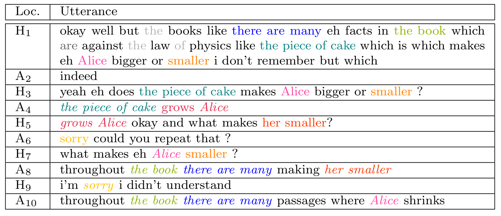
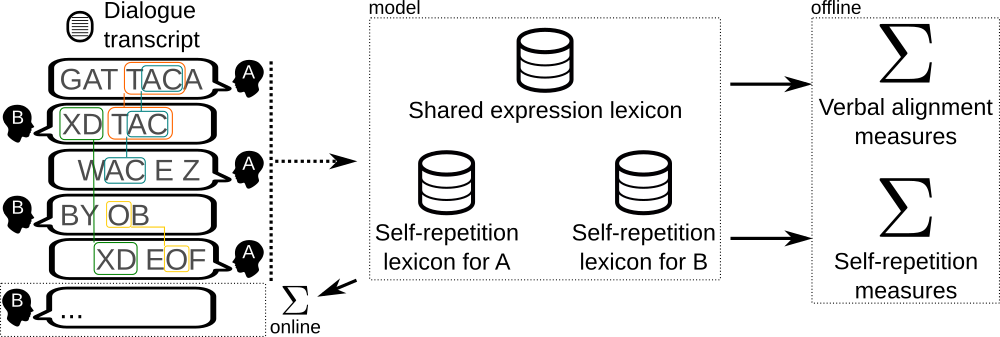

# dialign #

Latest version: 0.1.1 (alpha)

dialign is  a software that  provides automatic and generic  measures of
verbal alignment and self-repetitions in  dyadic dialogue based on  sequential 
pattern mining at the level of surface of text utterances.

A good place to start can be found in the following paper:
- Dubuisson Duplessis, G.; Clavel, C.; Landragin, F., 
  **Automatic Measures to Characterise Verbal Alignment in Human-Agent Interaction**, 18th Annual Meeting of the Special Interest Group on Discourse and Dialogue (SIGDIAL), 2017, pp. 71--81 
  \[[See paper](http://www.sigdial.org/workshops/conference18/proceedings/pdf/SIGDIAL10.pdf) | [BIB](http://www.sigdial.org/workshops/conference18/proceedings/bib/SIGDIAL10.bib)\]

`dialign`  is based  on the  observation that  the behaviours  of dialogue
participants tend to converge and  automatically align at several levels
(such as the lexical, syntactic  and semantic ones).  One consequence of
successful alignment at several  levels between dialogue participants is
a certain  repetitiveness in  dialogue leading to  the development  of a
lexicon  of   fixed  expressions.   As   a  matter  of   fact,  dialogue
participants tend  to automatically establish and  use fixed expressions
that become dialogue routines.
More concretely, here follows an excerpt of a dialogue between a human and an
agent operated by a Woz where instances of shared lexical patterns are coloured (from [[1]](#references)):



`dialign` provides a framework to quantify the interactive lexical alignment process 
and the self-repetition behaviour of dialogue participants (DPs) in dyadic textual 
dialogues. This framework focuses on lexical patterns occurring in dialogue utterances. 
It distinguishes two main types of such patterns. The first type is shared lexical
patterns between DPs, i.e., patterns that are initiated (or primed) by a DP,
subsequently adopted by the other DP and possibly reused during the dialogue by any DP. 
These patterns are directly related to the interactive verbal
alignment process, a particular type of on-the-fly linguistic adaptation. They
can be seen as shared dialogue routines at the lexical level. They are a way
to verbally align and ultimately share a common language to improve understanding, 
collaboration and social connection to a conversational partner. 
The second type is lexical self -repetition. Contrary to the previous type which considers 
patterns that are shared between DPs, self-repetition considers each DP
in isolation. Self-repetitions are lexical patterns appearing at least twice
in the dialogue utterances of a given DP, independently of the other DP's
utterances. Self-repetitions are directly related to the self-consistency of the
linguistic production of a given DP.



The main concept behind our model is the automatically built lexicon. For each
dialogue transcript, three lexicons are automatically computed:
- the shared expression lexicon: keeps  track of shared  expressions and valuable features about these  expressions  (e.g.,  who  first produced  this  expression,  its frequency)
- one self-repetition lexicon per DP: keeps  track of self-repetitions and valuable features about these  patterns  (e.g., its frequency)

Lexicons and the dialogue transcript are leveraged by deriving offline and
online measures to quantify aspects of the verbal alignment process and the
self-repetition behaviour of DPs. Offline measures are intended to be used for
past dialogue interactions (e.g., corpus studies) while online measures are intended
for use in a dialogue system.

`dialign` currently provides out-of-the box offline measures for corpus studies.
Online usage in a dialogue system is under way and not yet available.

### Measures Provided by dialign

`dialign` provides a set of measures to characterise both:
1. the interactive verbal alignment process between dialogue participants, and
2. the self-repetition behaviour of each participant.

These measures allow the characterisation of the nature of these processes by addressing 
various informative aspects such as their variety, strength, complexity, stability, and 
orientation. In a nutshell:
- **variety**: the variety of shared expressions or self-expressions emerging during a dialogue 
               relative to its length. It is directly related to the number of unique 
               expressions in a lexicon. 
- **strength**: the strength of repetition of the (shared) lexical patterns, i.e., how much the
                patterns are reused.
- **complexity**: the complexity indicates the variety of the types of lexical patterns. It is here 
                  featured by Shannon entropy measures. High entropy indicates the presence of
                  a wide range of lexical patterns relative to their lengths in number of tokens (e.g., ranging 
                  from a single word to a full sentence). On the contrary, low entropy indicates the predominance 
                  of one type of lexical pattern.
- **extension** and **stability**: The extension and stability of the (shared) lexical patterns are related 
                                   to the size of the lexical patterns. The extension indicates the size of the 
                                   lexical patterns. The longer it is, the more extended the lexical pattern is. 
                                   Extension is directly linked to the stability of the processes since the 
                                   more extended the patterns are, the more stable the processes are.
- **orientation**: the orientation of the interactive alignment process, i.e., it indicates either a symmetry 
                   (both dialogue participants initiate and reuse the same number of shared lexical patterns),
                   or an asymmetry (a dialogue participant initiates and/or reuse more shared lexical patterns).

#### Measures Characterising the Interactive Verbal Alignment Process
##### Speaker-independent
| Measure | Description |  Aspects |
| :---:   | :---       |  :---:   |
|  EV     |  Expression Variety (EV). The shared expression lexicon size normalized by the length of the dialogue (which is its total number of tokens in the dialogue).  | Variety | 
|  ER     |  Expression Repetition (ER). The proportion of tokens which DPs dedicate to the repetition of a shared expression.  | Strength |
| ENTR    | Shannon entropy of the lengths in token of the shared expression instances. | Complexity |
| L       | Average length in token of the shared expression instances. | Stability |
| LMAX    | Maximum length in token of the shared expression instances. | Stability |

##### Speaker-dependent

| Measure | Description |  Aspects |
| :---:   | :---       |  :---:   |
|  IE_S     |  Initiated Expression (IE) for locutor S. Ratio of shared expressions initiated by locutor S.   | Orientation | 
|  ER_S     |  Expression Repetition (ER) for locutor S. Ratio of tokens produced by S belonging to an instance of a shared expression.  | Strength |

#### Measures Characterising Self-Repetition Behaviour of each Dialogue Participant
| Measure | Description |  Aspects |
| :---:   | :---       |  :---:   |
|  SEV_S  |  Self-Expression Variety (SEV) for locutor S. For locutor S, the self-repetition lexicon size normalized by the total number of tokens produced by S in the dialogue.  | Variety | 
|  SER_S     |  Self-Expression Repetition (SER) for locutor S. The proportion of tokens which locutor S dedicates to self-repetition.| Strength |
| SENTR_S    |  Shannon entropy of the length in token of the self-repetitions from S. | Complexity |
| SL_S       |  Average length in tokens of the self-repetitions from S. | Stability |
| SLMAX_S    |  Maximum length in token of the self-repetitions from S. | Stability |

### Synthetic Presentation of the provided Measures
| Aspect      | Speaker-independent Measures (*) | Speaker-dependent Measures (**) |
| :---:       | :---:                            | :---:                           |
| Variety     | EV                               |  SEV_S                          | 
| Strength    | ER                               |  ER_S, SER_S                    |
| Complexity  | ENTR                             |  SENTR_S                        |
| Stability   | L, LMAX                          |  SL_S, SLMAX_S                  |
| Orientation |  --                              |  IE_S                           |

(*) All these measures are related to the interactive verbal alignment process

(**) Measures starting with 'S' are related to the self-repetition behaviour, the others
     are related to the interactivate verbal alignment process

## Installation ##

### From JAR (preferred way) ###

A ready-to-use JAR is available on github. Check the [latest release](https://github.com/GuillaumeDD/dialign/releases)!

### From source code (for developers) ###

You can generate the JAR from [SBT](http://www.scala-sbt.org/).

First, clone the repository. Then, you can compile the code:

	$ sbt compile

Eventually, you can produce the JAR as follows 
(requires [sbt-assembly](https://github.com/sbt/sbt-assembly)):

	$ sbt assembly

The JAR file can be probably found in the directory `dialign/target/scala-2.13/`.

## Usage ##

`dialign` is designed to be **easy to use** from the command line interface.

### Tutorial
A complete **walkthrough tutorial** is available in the 
[examples/ directory](examples/README.md). 

### CLI Usage Example ###

Let's  say  that   the  dialogue  files  are  in   the  input  directory
`input-directory/`  and   that  output  is  planned   in  the  directory
`output-directory/`. To run `dialign`  with this configuration, proceed as
follows:
```bash
java -jar dialign.jar -i input-directory/ -o output-directory/
```

`dialign`  allows to  filter input  dialogue files  by prefix,  suffix and
extension. For  instance, if the  only input dialogue files  to consider
are files matching the  following pattern: `dialogue-*-cleaned.dial`, it
is possible use the following options with dialign:
```bash
java -jar dialign.jar -i input-directory/ -o output-directory/ \
	-p "dialogue-" \ # specification of a required filename prefix
	-s "-cleaned" \ # specification of a required filename suffix
	-e "tsv" # specification of the extension (without the '.')
```

More options are available, see usage note:
```bash
java -jar dialign.jar -h
```

## Contributors ##

- Guillaume Dubuisson Duplessis (2017, 2018, 2019, 2020)

## Usage for Research Purposes ##

If you use this software for  research purposes, please make reference to
it by citing the following paper:
- Dubuisson Duplessis, G.; Clavel, C.; Landragin, F., **Automatic Measures to Characterise Verbal Alignment in Human-Agent Interaction**, 18th Annual Meeting of the Special Interest Group on Discourse and Dialogue (SIGDIAL), 2017, pp. 71--81 \[[See paper](http://www.sigdial.org/workshops/conference18/proceedings/pdf/SIGDIAL10.pdf) | [BIB](http://www.sigdial.org/workshops/conference18/proceedings/bib/SIGDIAL10.bib)\]

The authors  of this work would  be happy to  hear about you if  you are
using this code! Please, do not hesitate to contact us:
- G. Dubuisson Duplessis <[website](http://www.dubuissonduplessis.fr/contact.html)>
- C. Clavel <[website](https://clavel.wp.imt.fr/)>
- F. Landragin <[website](http://fred.landragin.free.fr/)>

## References ##
- [0] Dubuisson Duplessis, G.; Clavel, C.; Landragin, F., **Automatic Measures to Characterise Verbal Alignment in Human-Agent Interaction**, 18th Annual Meeting of the Special Interest Group on Discourse and Dialogue (SIGDIAL), 2017, pp. 71--81 \[[See paper](http://www.sigdial.org/workshops/conference18/proceedings/pdf/SIGDIAL10.pdf) [BIB](http://www.sigdial.org/workshops/conference18/proceedings/bib/SIGDIAL10.bib)\]
- [1] Dubuisson Duplessis, G.; Langlet, C.; Clavel, C.; Landragin, F., **Towards Alignment Strategies in Human-Agent
                                                                         Interactions based on Measures of Lexical
                                                                         Repetitions**, TODO, 2020, pp. XX-XX \[[See paper](http://www.sigdial.org/workshops/conference18/proceedings/pdf/SIGDIAL10.pdf) | [BIB](http://www.sigdial.org/workshops/conference18/proceedings/bib/SIGDIAL10.bib)\]


## License ##

CECILL-B - see the LICENSE file.
